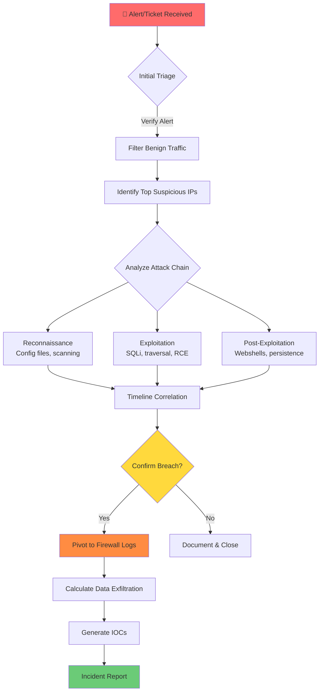

<p align="center">
  
  
  
  
</p>

<h1 align="center">🔍 Splunk Security Investigation Playbook</h1>

<p align="center">
  <strong>Comprehensive SPL queries and detection techniques for SOC analysts and incident responders</strong>
</p>

<p align="center">
  <a href="#-quick-reference">Quick Reference</a> •
  <a href="#-investigation-workflow">Workflow</a> •
  <a href="#-query-library">Queries</a> •
  <a href="#-automated-alerts">Alerts</a> •
  <a href="#-troubleshooting">Troubleshooting</a>
</p>

---

## ⚠️ Legal & Professional Disclaimer

> **This playbook is for authorized defensive security purposes only.**
>
> - Use only on systems you own or have explicit written authorization to analyze
> - Ensure compliance with local, state, and federal laws
> - Never share investigation data containing real client information
> - Consult legal/compliance teams if uncertain about authorization

---

## 📋 Table of Contents

<details>
<summary><strong>Click to expand</strong></summary>

- [Quick Reference](#-quick-reference)
- [Investigation Workflow](#-investigation-workflow)
- [Attack Framework](#-attack-framework)
- [Query Library](#-query-library)
  - [Initial Triage](#1️⃣-initial-triage)
  - [Timeline Analysis](#2️⃣-timeline-analysis)
  - [Traffic Filtering](#3️⃣-traffic-filtering)
  - [Reconnaissance Detection](#4️⃣-reconnaissance-detection)
  - [Exploitation Detection](#5️⃣-exploitation-detection)
  - [Post-Exploitation](#6️⃣-post-exploitation)
  - [C2 & Exfiltration](#7️⃣-c2--exfiltration)
- [Automated Alerts](#-automated-alerts)
- [False Positives Guide](#-false-positives-guide)
- [Environment Setup](#-environment-setup)
- [Troubleshooting](#-troubleshooting)
- [Resources](#-resources)

</details>

---

## 🚀 Quick Reference

### Essential Queries Cheat Sheet

| Purpose | Query |
|:--------|:------|
| **Find top attackers** | `sourcetype=web_traffic user_agent!=*Mozilla* \| stats count by client_ip \| sort -count \| head 10` |
| **SQL injection tools** | `sourcetype=web_traffic user_agent IN ("*sqlmap*", "*Havij*", "*Nikto*")` |
| **Path traversal** | `sourcetype=web_traffic (path="*..*" OR uri="*../*")` |
| **Webshell hunting** | `sourcetype=web_traffic path IN ("*shell*", "*cmd*", "*backdoor*") method=POST` |
| **Config file access** | `sourcetype=web_traffic path IN ("*.env*", "*config*", "*.git*", "*wp-config*")` |
| **Exfiltration signs** | `sourcetype=firewall_logs action=ALLOWED \| stats sum(bytes_out) as total by src_ip \| where total > 1073741824` |
| **Brute force login** | `sourcetype=web_traffic uri="*login*" status=401 \| stats count by client_ip \| where count > 50` |
| **Suspicious uploads** | `sourcetype=web_traffic method=POST path IN ("*.php", "*.asp*", "*.jsp", "*.exe")` |

### Field Name Reference

> ⚡ **Tip:** Field names vary by environment. Use `| fieldsummary` to discover your field names.

| Common Names | Alternatives |
|:-------------|:-------------|
| `client_ip` | `src_ip`, `clientip`, `c_ip`, `src` |
| `user_agent` | `useragent`, `user-agent`, `http_user_agent`, `ua` |
| `path` | `uri`, `uri_path`, `url`, `request`, `cs_uri_stem` |
| `status` | `status_code`, `http_status`, `sc_status`, `response_code` |
| `method` | `http_method`, `cs_method`, `request_method` |
| `bytes_transferred` | `bytes`, `bytes_out`, `sc_bytes`, `response_size` |

---

## 🔄 Investigation Workflow

```
┌─────────────────────────────────────────────────────────────────────────────┐
│                        INCIDENT RESPONSE WORKFLOW                           │
├─────────────────────────────────────────────────────────────────────────────┤
│                                                                             │
│   ┌──────────┐    ┌──────────┐    ┌──────────┐    ┌──────────┐             │
│   │  ALERT   │───►│  TRIAGE  │───►│ IDENTIFY │───►│  SCOPE   │             │
│   │ RECEIVED │    │  VERIFY  │    │ ATTACKER │    │  IMPACT  │             │
│   └──────────┘    └──────────┘    └──────────┘    └──────────┘             │
│        │              │                │               │                    │
│        ▼              ▼                ▼               ▼                    │
│   Section 1      Section 2        Section 3       Sections 4-7             │
│                                                                             │
│   ┌──────────┐    ┌──────────┐    ┌──────────┐    ┌──────────┐             │
│   │ CONTAIN  │───►│ REMEDIATE│───►│ RECOVER  │───►│  REPORT  │             │
│   │  THREAT  │    │   ROOT   │    │ SYSTEMS  │    │ LESSONS  │             │
│   └──────────┘    └──────────┘    └──────────┘    └──────────┘             │
│                                                                             │
└─────────────────────────────────────────────────────────────────────────────┘
```

### Step-by-Step Process



---

## 🎯 Attack Framework

### MITRE ATT&CK Coverage

| Phase | Tactic | Techniques Detected | Query Section |
|:------|:-------|:--------------------|:--------------|
| **Recon** | Reconnaissance | T1595 Active Scanning | [Section 4](#4️⃣-reconnaissance-detection) |
| **Initial Access** | Initial Access | T1190 Exploit Public App | [Section 5](#5️⃣-exploitation-detection) |
| **Execution** | Execution | T1059 Command & Scripting | [Section 6](#6️⃣-post-exploitation) |
| **Persistence** | Persistence | T1505.003 Web Shell | [Section 6](#6️⃣-post-exploitation) |
| **Exfiltration** | Exfiltration | T1041 Exfil Over C2 | [Section 7](#7️⃣-c2--exfiltration) |
| **C2** | Command & Control | T1571 Non-Standard Port | [Section 7](#7️⃣-c2--exfiltration) |

### Cyber Kill Chain Mapping

```
┌────────────────────────────────────────────────────────────────────────────┐
│                           CYBER KILL CHAIN                                 │
├────────────────────────────────────────────────────────────────────────────┤
│                                                                            │
│  Phase 1        Phase 2        Phase 3        Phase 4        Phase 5      │
│  ════════       ════════       ════════       ════════       ════════     │
│                                                                            │
│  ┌────────┐    ┌────────┐    ┌────────┐    ┌────────┐    ┌────────┐      │
│  │ RECON  │───►│WEAPON- │───►│DELIVERY│───►│EXPLOIT │───►│INSTALL │      │
│  │        │    │IZATION │    │        │    │        │    │        │      │
│  └────────┘    └────────┘    └────────┘    └────────┘    └────────┘      │
│       │                           │             │             │           │
│       ▼                           ▼             ▼             ▼           │
│   Scanning                    HTTP/S        SQLi/RCE      Webshell       │
│   Enumeration                 Requests      Traversal     Backdoor       │
│                                                                            │
│                                                                            │
│  Phase 6        Phase 7                                                   │
│  ════════       ════════                                                  │
│                                                                            │
│  ┌────────┐    ┌────────┐                                                 │
│  │COMMAND │───►│ACTIONS │                                                 │
│  │CONTROL │    │ON OBJ  │                                                 │
│  └────────┘    └────────┘                                                 │
│       │             │                                                      │
│       ▼             ▼                                                      │
│   C2 Tunnel     Data Theft                                                │
│   Beaconing     Ransomware                                                │
│                                                                            │
└────────────────────────────────────────────────────────────────────────────┘
```

---

## 📚 Query Library

### 1️⃣ Initial Triage

#### Verify Data Availability

```spl
| tstats count WHERE index=* by index, sourcetype 
| sort -count
```

> **Purpose:** Confirm which indices and sourcetypes contain data before starting investigation.

#### Basic Web Traffic Query

```spl
index=main sourcetype=web_traffic
| head 100
| table _time, client_ip, method, path, status, user_agent
```

#### Event Volume Overview

```spl
index=main sourcetype=web_traffic
| stats count as total_events, 
        dc(client_ip) as unique_ips,
        dc(path) as unique_paths,
        earliest(_time) as first_event,
        latest(_time) as last_event
| eval first_event=strftime(first_event, "%Y-%m-%d %H:%M:%S")
| eval last_event=strftime(last_event, "%Y-%m-%d %H:%M:%S")
```

---

### 2️⃣ Timeline Analysis

#### Daily Activity Heatmap

```spl
index=main sourcetype=web_traffic
| eval hour=strftime(_time, "%H")
| eval day=strftime(_time, "%A")
| stats count by day, hour
| xyseries day hour count
```

> **Use Case:** Identify attack patterns — automated tools often run at consistent times.

#### Peak Activity Detection

```spl
index=main sourcetype=web_traffic
| bin _time span=1h
| stats count by _time
| sort -count
| head 10
| eval timestamp=strftime(_time, "%Y-%m-%d %H:%M")
| table timestamp, count
```

#### Attack Progression Timeline

```spl
index=main sourcetype=web_traffic client_ip="<ATTACKER_IP>"
| transaction client_ip maxspan=1h
| table _time, duration, eventcount, path
| sort _time
```

---

### 3️⃣ Traffic Filtering

#### Remove Legitimate Browser Traffic

```spl
index=main sourcetype=web_traffic
| where NOT match(user_agent, "(?i)(Mozilla|Chrome|Safari|Firefox|Edge|Opera)")
| stats count by client_ip, user_agent
| sort -count
```

> **Rationale:** 
> - Legitimate users use standard browsers
> - Attackers often use tools with distinctive user agents (curl, wget, python-requests, sqlmap)

#### Identify Top Suspicious IPs

```spl
index=main sourcetype=web_traffic
| where NOT match(user_agent, "(?i)(Mozilla|Chrome|Safari|Firefox|Edge)")
| stats count as requests,
        dc(path) as unique_paths,
        values(user_agent) as user_agents
  by client_ip
| where requests > 100
| sort -requests
| head 10
```

> **Action:** The IP with highest request count and diverse paths is typically the primary attacker.

#### Suspicious User-Agent Analysis

```spl
index=main sourcetype=web_traffic
| rex field=user_agent "^(?<tool>[^\s/]+)"
| stats count, dc(client_ip) as unique_ips by tool
| where count > 10 AND NOT match(tool, "(?i)(Mozilla|Chrome|Safari)")
| sort -count
```

**Known Malicious User-Agents:**

| User-Agent Pattern | Tool Type |
|:-------------------|:----------|
| `sqlmap/*` | SQL Injection Scanner |
| `Nikto/*` | Web Vulnerability Scanner |
| `Nessus/*` | Vulnerability Scanner |
| `Havij` | SQL Injection Tool |
| `DirBuster/*` | Directory Bruteforcer |
| `Gobuster/*` | Directory/DNS Bruteforcer |
| `python-requests/*` | Scripted Attacks |
| `curl/*` | Scripted/Manual Testing |
| `Wget/*` | Scripted Downloads |
| `masscan/*` | Port Scanner |

---

### 4️⃣ Reconnaissance Detection

#### Configuration File Probing

```spl
index=main sourcetype=web_traffic client_ip="<ATTACKER_IP>"
| where match(path, "(?i)(\.env|\.git|\.svn|\.htaccess|web\.config|\.DS_Store|\.idea|config\.php|wp-config|settings\.py|\.aws|\.ssh)")
| stats count by path, status
| sort -count
```

**Critical Files to Monitor:**

| File/Path | Risk | Data Exposed |
|:----------|:-----|:-------------|
| `/.env` | 🔴 Critical | API keys, DB credentials, secrets |
| `/.git/config` | 🔴 Critical | Repository URLs, deployment keys |
| `/wp-config.php` | 🔴 Critical | WordPress DB credentials |
| `/.aws/credentials` | 🔴 Critical | AWS access keys |
| `/phpinfo.php` | 🟠 High | Server config, PHP version, modules |
| `/server-status` | 🟠 High | Apache status, active connections |
| `/.htaccess` | 🟡 Medium | URL rewrite rules, auth config |

#### Directory Enumeration Detection

```spl
index=main sourcetype=web_traffic client_ip="<ATTACKER_IP>"
| where status IN (403, 404)
| stats count by path
| where count > 5
| sort -count
| head 50
```

> **Indicator:** High volume of 404s to sequential paths indicates directory bruteforcing.

#### Information Disclosure Endpoints

```spl
index=main sourcetype=web_traffic
| where match(path, "(?i)(phpinfo|server-status|server-info|debug|trace|actuator|metrics|health|swagger|api-docs)")
| where status=200
| stats count by client_ip, path
| sort -count
```

---

### 5️⃣ Exploitation Detection

#### SQL Injection Attempts

```spl
index=main sourcetype=web_traffic client_ip="<ATTACKER_IP>"
| where match(path, "(?i)(union.*select|select.*from|insert.*into|delete.*from|drop.*table|'.*or.*'|\".*or.*\"|;.*--|%27|%22|%3B)")
  OR match(user_agent, "(?i)(sqlmap|havij|pangolin)")
| table _time, path, status, user_agent
| sort _time
```

> **Confirmation:**
> - HTTP 200 responses + SQL tool UA = likely successful injection
> - Large response sizes = data extraction in progress

#### Path Traversal Detection

```spl
index=main sourcetype=web_traffic client_ip="<ATTACKER_IP>"
| where match(path, "(\.\.\/|\.\.\\|%2e%2e%2f|%2e%2e\/|\.\.%2f|%252e)")
| stats count by path
| sort -count
```

**Common Traversal Targets:**

```
../../../etc/passwd
../../../etc/shadow
../../../windows/system32/config/sam
..\..\..\..\windows\win.ini
```

#### Command Injection Detection

```spl
index=main sourcetype=web_traffic client_ip="<ATTACKER_IP>"
| where match(path, "(?i)(;|\||`|\$\(|%0a|%0d).*?(cat|ls|dir|whoami|id|pwd|wget|curl|nc|bash|sh|cmd|powershell)")
| table _time, path, status, user_agent
```

#### XSS Attempt Detection

```spl
index=main sourcetype=web_traffic
| where match(path, "(?i)(<script|javascript:|onerror|onload|onclick|%3cscript|%3e)")
| stats count by client_ip, path
| sort -count
```

#### File Upload Exploitation

```spl
index=main sourcetype=web_traffic method=POST
| where match(path, "(?i)(upload|file|attach|import)")
| where match(path, "(?i)\.(php|asp|aspx|jsp|cgi|pl|py|sh|exe|dll|bat|ps1)$")
  OR status=200
| table _time, client_ip, path, status, user_agent
| sort _time
```

---

### 6️⃣ Post-Exploitation

#### Webshell Detection

```spl
index=main sourcetype=web_traffic method IN (GET, POST)
| where match(path, "(?i)(shell|cmd|backdoor|c99|r57|b374k|webadmin|filemanager|phpspy|adminer)")
  OR match(path, "(?i)\?(cmd|exec|command|c|id|action|act|do)=")
| stats count by client_ip, path, method, status
| sort -count
```

**Known Webshell Indicators:**

| Pattern | Type |
|:--------|:-----|
| `c99.php`, `r57.php` | PHP Webshells |
| `?cmd=`, `?c=` | Command Parameter |
| `?action=exec` | Execution Parameter |
| `shell.aspx` | ASP.NET Webshell |
| `cmd.jsp` | Java Webshell |

#### Malicious File Access

```spl
index=main sourcetype=web_traffic client_ip="<ATTACKER_IP>"
| where match(path, "(?i)\.(php|asp|aspx|jsp|cgi)$") AND method=POST
| stats count by path, status
| where status=200
| sort -count
```

#### Backup & Sensitive File Download

```spl
index=main sourcetype=web_traffic client_ip="<ATTACKER_IP>"
| where match(path, "(?i)(backup|dump|export|\.sql|\.zip|\.tar|\.gz|\.rar|\.7z|\.bak|\.old|\.log)")
| where status=200
| stats sum(bytes) as total_bytes by path
| eval size_mb=round(total_bytes/1048576, 2)
| sort -total_bytes
```

#### Privilege Escalation Indicators

```spl
index=main sourcetype=web_traffic client_ip="<ATTACKER_IP>"
| where match(path, "(?i)(admin|root|superuser|manager|administrator|cpanel|phpmyadmin|wp-admin)")
| stats count by path, status
| sort -count
```

---

### 7️⃣ C2 & Exfiltration

#### Outbound C2 Communication

```spl
index=main sourcetype=firewall_logs src_ip="<COMPROMISED_INTERNAL_IP>"
| where action="ALLOWED" AND NOT match(dest_ip, "^(10\.|172\.(1[6-9]|2[0-9]|3[01])\.|192\.168\.)")
| stats count, 
        sum(bytes_out) as total_bytes,
        dc(dest_port) as unique_ports,
        values(dest_port) as ports
  by dest_ip
| sort -count
| head 20
```

> **Red Flags:**
> - Outbound HTTPS to non-standard ports (8443, 4443, 9443)
> - Connections to IP addresses (not domains)
> - Regular interval beaconing patterns

#### Beaconing Detection

```spl
index=main sourcetype=firewall_logs src_ip="<COMPROMISED_IP>" dest_ip="<SUSPICIOUS_IP>"
| bin _time span=1m
| stats count by _time
| eventstats avg(count) as avg_count, stdev(count) as std_dev
| where abs(count - avg_count) < std_dev
| stats count as beacon_intervals
```

> **Indicator:** Consistent connection intervals suggest automated C2 beaconing.

#### Data Exfiltration Volume

```spl
index=main sourcetype=firewall_logs src_ip="<COMPROMISED_IP>" action="ALLOWED"
| stats sum(bytes_out) as total_bytes by dest_ip
| eval total_mb=round(total_bytes/1048576, 2)
| eval total_gb=round(total_bytes/1073741824, 2)
| sort -total_bytes
| head 10
```

**Impact Assessment:**

| Volume | Severity | Likely Content |
|:-------|:---------|:---------------|
| < 100 MB | Low | Reconnaissance data, credentials |
| 100 MB - 1 GB | Medium | Database subsets, documents |
| 1 - 10 GB | High | Full database dumps |
| > 10 GB | Critical | Complete data exfiltration |

#### DNS Exfiltration Detection

```spl
index=main sourcetype=dns_logs
| where len(query) > 50
| rex field=query "(?<subdomain>[^.]+)\."
| where len(subdomain) > 30
| stats count by src_ip, query
| sort -count
```

> **Indicator:** Unusually long DNS subdomains may indicate data exfiltration via DNS tunneling.

---

## 🔔 Automated Alerts

### Ready-to-Use Alert Configurations

#### Alert 1: SQL Injection Tool Detection

```spl
index=main sourcetype=web_traffic
| where match(user_agent, "(?i)(sqlmap|havij|pangolin|sqlninja)")
| stats count by client_ip, user_agent
| where count > 5
```

| Setting | Value |
|:--------|:------|
| **Trigger** | Number of results > 0 |
| **Schedule** | Every 5 minutes |
| **Severity** | High |
| **Action** | Email SOC, Create ticket |

#### Alert 2: Brute Force Login Attempts

```spl
index=main sourcetype=web_traffic
| where match(path, "(?i)(login|signin|auth|session)")
| where status IN (401, 403)
| stats count by client_ip
| where count > 50
```

| Setting | Value |
|:--------|:------|
| **Trigger** | Number of results > 0 |
| **Schedule** | Every 5 minutes |
| **Severity** | Medium |
| **Action** | Email security team |

#### Alert 3: Webshell Activity

```spl
index=main sourcetype=web_traffic method=POST
| where match(path, "(?i)(shell|cmd|backdoor|c99|r57)")
  OR match(path, "\?(cmd|exec|c|id)=")
| where status=200
```

| Setting | Value |
|:--------|:------|
| **Trigger** | Number of results > 0 |
| **Schedule** | Every 1 minute |
| **Severity** | Critical |
| **Action** | Page on-call, Block IP |

#### Alert 4: Large Data Transfer

```spl
index=main sourcetype=firewall_logs action="ALLOWED"
| stats sum(bytes_out) as total by src_ip
| where total > 1073741824
| eval gb=round(total/1073741824, 2)
```

| Setting | Value |
|:--------|:------|
| **Trigger** | Number of results > 0 |
| **Schedule** | Every 15 minutes |
| **Severity** | High |
| **Action** | Email SOC, investigate |

#### Alert 5: Config File Access

```spl
index=main sourcetype=web_traffic
| where match(path, "(?i)(\.env|\.git|wp-config|\.aws|\.ssh)")
| where status=200
```

| Setting | Value |
|:--------|:------|
| **Trigger** | Number of results > 0 |
| **Schedule** | Every 5 minutes |
| **Severity** | Critical |
| **Action** | Immediate investigation |

---

## ⚡ False Positives Guide

### Common False Positive Scenarios

| Detection | False Positive Source | How to Exclude |
|:----------|:----------------------|:---------------|
| **Non-browser UA** | API integrations, monitoring tools | Whitelist known service accounts |
| **SQL injection patterns** | Search queries with quotes | Exclude known safe parameters |
| **Path traversal** | Legitimate relative URLs | Exclude internal application paths |
| **High request volume** | CDN/Load balancer health checks | Filter by known infrastructure IPs |
| **Brute force** | Password managers, SSO systems | Whitelist trusted auth sources |
| **Large transfers** | Backups, log rotation | Exclude scheduled maintenance windows |

### Exclusion Query Patterns

#### Exclude Internal IPs

```spl
| where NOT match(client_ip, "^(10\.|172\.(1[6-9]|2[0-9]|3[01])\.|192\.168\.)")
```

#### Exclude Known Good User-Agents

```spl
| where NOT match(user_agent, "(?i)(Pingdom|UptimeRobot|StatusCake|Datadog|NewRelic|Splunk)")
```

#### Exclude Monitoring Endpoints

```spl
| where NOT match(path, "(?i)(/health|/status|/ping|/metrics|/ready|/live)")
```

---

## ⚙️ Environment Setup

### Pre-Investigation Checklist

```spl
| Rest Query - Verify Indices
| rest /services/data/indexes 
| table title, currentDBSizeMB, totalEventCount
| sort -totalEventCount
```

```spl
| Discover Available Sourcetypes
index=* 
| stats count by sourcetype 
| sort -count
```

```spl
| Identify Field Names
index=main sourcetype=web_traffic 
| head 1 
| fieldsummary
| table field, distinct_count, values
```

### Recommended Index Configuration

| Index | Sourcetype | Retention | Purpose |
|:------|:-----------|:----------|:--------|
| `web` | `web_traffic` | 90 days | HTTP/HTTPS access logs |
| `firewall` | `firewall_logs` | 90 days | Network traffic logs |
| `dns` | `dns_logs` | 30 days | DNS query logs |
| `auth` | `auth_logs` | 365 days | Authentication events |
| `waf` | `waf_logs` | 90 days | Web Application Firewall logs |

---

## 🔧 Troubleshooting

### Issue: Query Returns No Results

**Diagnostic Steps:**

```spl
| Verify data exists
index=* earliest=-24h | stats count by index, sourcetype

| Check time range
index=main sourcetype=web_traffic
| stats earliest(_time) as first, latest(_time) as last
| eval first=strftime(first, "%Y-%m-%d %H:%M"), last=strftime(last, "%Y-%m-%d %H:%M")

| Verify field names exist
index=main sourcetype=web_traffic | fieldsummary | search field=client_ip OR field=user_agent
```

### Issue: Query Times Out

**Solutions:**

1. **Narrow time range:** Use `earliest=-24h latest=now`
2. **Add specific filters:** Include `client_ip="x.x.x.x"` early in query
3. **Use tstats for indexed fields:**
   ```spl
   | tstats count WHERE index=main sourcetype=web_traffic BY client_ip
   ```
4. **Limit results:** Add `| head 1000` during testing

### Issue: Field Names Don't Match

**Field Discovery Query:**

```spl
index=main sourcetype=web_traffic
| head 10
| transpose
| rename column as field, "row 1" as sample_value
```

### Issue: Regex Not Matching

**Test Regex:**

```spl
| makeresults 
| eval test_string="your test string here"
| where match(test_string, "your_regex_pattern")
```

---

## 📖 Resources

### Official Documentation

- [Splunk Search Reference](https://docs.splunk.com/Documentation/Splunk/latest/SearchReference)
- [Splunk Common Information Model](https://docs.splunk.com/Documentation/CIM/latest/User/Overview)
- [Splunk Security Essentials](https://splunkbase.splunk.com/app/3435/)

### Threat Intelligence

- [MITRE ATT&CK Framework](https://attack.mitre.org/)
- [Cyber Kill Chain - Lockheed Martin](https://www.lockheedmartin.com/en-us/capabilities/cyber/cyber-kill-chain.html)
- [NIST Cybersecurity Framework](https://www.nist.gov/cyberframework)

### OWASP References

- [OWASP Top 10 (2021)](https://owasp.org/Top10/)
- [OWASP Testing Guide](https://owasp.org/www-project-web-security-testing-guide/)
- [OWASP Cheat Sheet Series](https://cheatsheetseries.owasp.org/)

### Detection Engineering

- [Sigma Rules](https://github.com/SigmaHQ/sigma)
- [Splunk Security Content](https://github.com/splunk/security_content)
- [SANS Incident Handler's Handbook](https://www.sans.org/white-papers/33901/)

---

## 🤝 Contributing

**Want to improve this playbook?**

1. Fork the repository
2. Create a feature branch (`git checkout -b feature/new-detection`)
3. Add your query with:
   - Clear description of what it detects
   - MITRE ATT&CK mapping if applicable
   - Sample output or expected results
   - False positive considerations
4. Submit a Pull Request

**Contribution Guidelines:**
- Test queries before submitting
- Include field name alternatives for portability
- Document any environment-specific requirements
- Redact all real IP addresses and sensitive data

---

## 📄 License

This project is licensed under the **MIT License**.


<p align="center">
  <strong>⭐ Star this repository if you found it useful!</strong>
</p>

<p align="center">
  <em>Last Updated: December 2025 </em>
</p>

<p align="center">
  <a href="#-splunk-security-investigation-playbook">Back to Top ↑</a>
</p>
