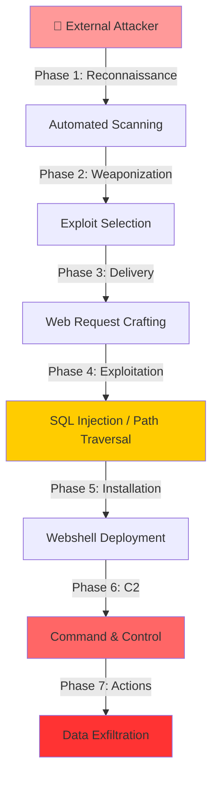

# 🔍 Splunk Security Investigation Playbook


## Overview

A comprehensive collection of **Splunk Search Processing Language (SPL)** queries and investigation techniques for detecting and analyzing web-based intrusion attempts. This playbook documents common attack patterns, detection methodologies, and forensic analysis approaches for security operations centers (SOCs) and incident response teams.

This resource is designed for **defensive security professionals** seeking to improve threat detection capabilities and incident response procedures.

---

## ⚠️ Legal & Professional Disclaimer

**IMPORTANT - READ BEFORE USE:**

This playbook is provided **strictly for educational and authorized defensive security purposes only**. 

### Terms of Use:

- **Authorization Required:** Only use these techniques and queries on systems you own or have explicit written permission to analyze.
- **Lawful Purpose:** Unauthorized computer system access is illegal. Ensure all investigations comply with local, state, and federal laws.
- **Professional Standards:** Use in accordance with your organization's security policies, data retention policies, and legal requirements.
- **Confidentiality:** All examples use redacted IP addresses and anonymized indicators. Never share investigation data containing real client information without authorization.
- **No Liability:** The author assumes no responsibility for misuse, damage, or legal consequences resulting from the application of this material.

**If you are uncertain about authorization for any investigation, consult with your legal and compliance teams.**

---

## 📋 Table of Contents

- [Quick Start](#quick-start)
- [Attack Overview](#attack-overview)
- [Investigation Framework](#investigation-framework)
- [Query Categories](#query-categories)
- [Defensive Capabilities](#defensive-capabilities)
- [Best Practices](#best-practices)
- [Troubleshooting](#troubleshooting)
- [Contributing](#contributing)
- [License](#license)

---

## Quick Start

### For SOC Analysts & Incident Responders:

1. **Identify the target IP:** Obtain the suspected attacker or compromised internal IP from your incident ticket
2. **Select relevant query category:** Choose from the sections below based on the attack phase
3. **Customize the query:** Replace `<REDACTED>` placeholders with your investigation parameters
4. **Execute in Splunk:** Copy the entire query into your Splunk search bar
5. **Analyze results:** Review the table output for indicators of compromise (IOCs)

### Example Investigation Workflow:

```
1. Start with "Filtering Out Benign Values" to identify anomalous traffic
   ↓
2. Use "Narrowing Down Suspicious IPs" to isolate attacker traffic
   ↓
3. Apply "Attack Chain Analysis" queries to trace activity progression
   ↓
4. Move to "Exploitation Detection" to confirm attack success
   ↓
5. End with "Post-Exploitation Activities" to assess breach scope
```

---

## Attack Overview

This playbook addresses the **Cyber Kill Chain** model across multiple attack phases:



---

## Investigation Framework

### MITRE ATT&CK Mapping

| Attack Phase | MITRE Tactic | Detection Method | Expected Indicators |
|:---|:---|:---|:---|
| **Reconnaissance** | Scanning & Enumeration | Non-browser User-Agent Analysis | Uncommon UA strings, Port scans |
| **Exploitation** | Initial Access, Execution | SQL Injection Tool Detection | SQLmap, Havij user agents |
| **Installation** | Persistence | Webshell Deployment | PHP/ASP file uploads, Execution attempts |
| **Command & Control** | Command & Control | Firewall Log Analysis | Outbound connections to suspicious IPs |
| **Actions** | Exfiltration | Data Transfer Monitoring | Compressed archives, High byte transfers |

---

## Query Categories

### 1️⃣ INITIAL INVESTIGATION

#### Basic Index Query
Returns all events from the primary data source.

```spl
index=main
```

#### Web Traffic Focus
Isolates web traffic events for application-layer analysis.

```spl
index=main sourcetype=web_traffic
```

**Use Case:** Initial triage of suspected web application attacks  
**Expected Output:** Raw event count and timestamp distribution

---

### 2️⃣ TIMELINE ANALYSIS

#### Daily Event Count Visualization

Generate a time-series graph showing attack volume progression.

```spl
index=main sourcetype=web_traffic 
| timechart span=1d count
```

**Use Case:** Identify peak attack activity periods  
**Expected Output:** Time-based chart with daily event counts

#### Peak Activity Identification

Rank days by event volume (highest first).

```spl
index=main sourcetype=web_traffic 
| timechart span=1d count 
| sort by count 
| reverse
```

**Use Case:** Determine when the attack was most intense  
**Expected Output:** Sorted list of dates with highest activity

---

### 3️⃣ FILTERING & IDENTIFICATION

#### Remove Legitimate Browser Traffic

Eliminate standard browser user agents to focus on suspicious activity. Legitimate browsers (Mozilla, Chrome, Safari, Firefox) are filtered out.

```spl
index=main sourcetype=web_traffic 
user_agent!=*Mozilla* 
user_agent!=*Chrome* 
user_agent!=*Safari* 
user_agent!=*Firefox*
```

**Rationale:** 
- Legitimate users generate expected traffic patterns
- Attackers often use automation tools with non-standard user agents
- cURL, Wget, Burp Suite, and custom scripts have distinctive signatures

**Expected Results:** 
- Automated scanner traffic (vulnerability scanning tools)
- API requests without browser identification
- Bot activity and exploitation attempts

#### Identify Top Suspicious IPs

Rank client IPs by request volume, filtering non-browser traffic.

```spl
sourcetype=web_traffic 
user_agent!=*Mozilla* 
user_agent!=*Chrome* 
user_agent!=*Safari* 
user_agent!=*Firefox* 
| stats count by client_ip 
| sort -count 
| head 5
```

**Use Case:** Pinpoint the primary attacker IP address  
**Expected Output:** Top 5 IPs with highest request counts  
**Action:** Investigate the top result first—this is typically the attacker

---

### 4️⃣ ATTACK CHAIN ANALYSIS

#### Reconnaissance Activity Detection

Monitor probes targeting sensitive configuration files and information disclosure endpoints.

```spl
sourcetype=web_traffic 
client_ip="<REDACTED>" 
AND path IN ("/.env", "/*phpinfo*", "/.git*") 
| table _time, path, user_agent, status
```

**What These Paths Indicate:**
- `/.env` – Environment configuration files (API keys, database credentials)
- `/phpinfo.php` – PHP information disclosure (server version, installed modules)
- `/.git/config` – Git repository exposure (source code, deployment keys)

**Expected Findings:** Multiple 200/403 responses indicate successful enumeration

#### Path Traversal & Open Redirect Testing

Detect attempts to bypass directory restrictions or exploit open redirects.

```spl
sourcetype=web_traffic 
client_ip="<REDACTED>" 
AND (path="*..*" OR path="*redirect*")
```

**Exploitation Patterns:**
- `../../../etc/passwd` – Directory traversal attempts
- `/page?redirect=http://attacker.com` – Open redirect exploitation

#### Vulnerability Scanning Summary

Aggregate traversal attempts by target path.

```spl
sourcetype=web_traffic 
client_ip="<REDACTED>" 
AND (path="*..\/..\/*" OR path="*redirect*") 
| stats count by path 
| sort -count
```

**Use Case:** Identify which application endpoints are most frequently targeted  
**Implication:** Most-targeted paths are likely vulnerable or contain sensitive data

---

### 5️⃣ EXPLOITATION DETECTION

#### SQL Injection Attack Identification

Detect automated SQL injection tools by distinctive user agent signatures.

```spl
sourcetype=web_traffic 
client_ip="<REDACTED>" 
AND user_agent IN ("*sqlmap*", "*Havij*") 
| table _time, path, status
```

**Tool Signatures:**
- **SQLmap:** Open-source automated SQL injection framework
- **Havij:** Commercial penetration testing tool for SQL injection
- Both tools generate uniquely identifiable HTTP headers

**Confirmation of Exploitation:**
- HTTP 200 responses to injection payloads = likely successful
- Large response sizes = data extraction in progress
- Repeated requests to same parameter = systematic enumeration

**MITRE:** Technique T1190 (Exploit Public-Facing Application)

---

### 6️⃣ POST-EXPLOITATION ACTIVITIES

#### Data Exfiltration Monitoring

Detect attempts to download sensitive data (backups, logs, databases).

```spl
sourcetype=web_traffic 
client_ip="<REDACTED>" 
AND path IN ("*backup*", "*logs*", "*.zip", "*.tar*", "*.sql*") 
| table _time, path, user_agent, status
```

**Exfiltration Indicators:**
- `backup.zip` – Database or application backups
- `logs.tar.gz` – Access logs containing sensitive information
- `*.sql` – Direct database exports
- Large file downloads over HTTP (should use SFTP/secure protocols)

**MITRE:** Technique T1020 (Exfiltration Over Alternative Protocol)

#### Ransomware & Webshell Detection

Identify malicious binary uploads and command execution.

```spl
sourcetype=web_traffic 
client_ip="<REDACTED>" 
AND (path IN ("*.bin", "*.exe", "*.sh") OR path="*shell*" OR path="*cmd=*") 
| table _time, path, user_agent, status
```

**Critical Indicators:**
- `.bin` or `.exe` file uploads = potential ransomware staging
- `shell.php`, `cmd.aspx`, `webshell.jsp` = web-accessible backdoors
- Query parameters like `?cmd=`, `?id=`, `?action=` = command execution

**HTTP 200 Response + POST method = File successfully uploaded and potentially executed**

**MITRE:** Technique T1190 (Exploit Public-Facing Application) + T1105 (Ingress Tool Transfer)

---

### 7️⃣ COMMAND & CONTROL DETECTION

#### Outbound C2 Communication

Pivot to firewall logs to confirm post-exploitation persistence.

```spl
sourcetype=firewall_logs 
src_ip="<INTERNAL_COMPROMISED_IP>" 
AND dest_ip="<REDACTED>" 
AND action="ALLOWED" 
| table _time, action, protocol, src_ip, dest_ip, dest_port, reason
```

**Investigation Approach:**
1. An internal server was compromised via web application vulnerability
2. Attacker deployed persistent backdoor (webshell/implant)
3. Firewalls rules unexpectedly allow outbound traffic to attacker infrastructure
4. Regular encrypted tunnel communication established

**Red Flags:**
- Outbound HTTPS to non-standard ports (8443, 4443, 9443)
- Established connections during off-business hours
- Connections to IP addresses in known malicious ranges

**MITRE:** Technique T1571 (Non-Standard Port)

#### Data Exfiltration Volume Calculation

Quantify the breach scope by total bytes transferred.

```spl
sourcetype=firewall_logs 
src_ip="<INTERNAL_COMPROMISED_IP>" 
AND dest_ip="<REDACTED>" 
AND action="ALLOWED" 
| stats sum(bytes_transferred) as total_bytes by src_ip 
| eval total_gb=round(total_bytes/1024/1024/1024, 2)
```

**Output Interpretation:**
- **< 1 GB:** Limited reconnaissance or partial data theft
- **1-10 GB:** Significant data exfiltration (databases, file shares)
- **> 10 GB:** Complete database dumps or entire file system backups

---

## Defensive Capabilities

### What You Can Detect With These Queries

✅ **Reconnaissance:** Vulnerability scanning, enumeration attempts  
✅ **Exploitation:** SQL injection, path traversal, file upload attacks  
✅ **Persistence:** Webshell creation and command execution  
✅ **Command & Control:** Outbound C2 communication patterns  
✅ **Exfiltration:** Data theft and backup downloads  

### What These Queries Do NOT Detect

❌ **Encryption-breaking techniques** (queries work only with unencrypted logs)  
❌ **Highly obfuscated attacks** (may bypass user-agent filters)  
❌ **Zero-day exploits** (signatures only detect known tools)  
❌ **Internal lateral movement** (requires endpoint detection and response tools)  
❌ **Memory-only malware** (requires EDR solutions)

---

## Best Practices

### Before Running Queries:

1. **Verify Index Availability**
   ```spl
   | rest /services/data/indexes
   ```
   Ensure `web_traffic` and `firewall_logs` indices exist and contain data.

2. **Adjust Time Windows**
   - Use Splunk's time picker (right side of search bar)
   - Start broad (24-48 hours), then narrow down to peak activity

3. **Validate Source Types**
   ```spl
   index=main | stats count by sourcetype
   ```
   Confirm your environment uses expected source type names.

### During Investigation:

4. **Protect Sensitive Output**
   - Export results to CSV and store on encrypted drives
   - Never share unredacted query results with vendors or external parties
   - Anonymize IP addresses before incident reports

5. **Document Your Findings**
   - Screenshot each query result
   - Note timestamps and attack progression
   - Save queries in a text file for your incident report

6. **Chain Multiple Queries**
   - Don't rely on single query result
   - Cross-reference findings across web logs AND firewall logs
   - Look for temporal correlation (events happening in sequence)

### After Investigation:

7. **Create Alerts**
   - Save high-value queries as saved searches
   - Convert to alerts that trigger on detection threshold
   - Build dashboard showing real-time attack status

8. **Share Knowledge**
   - Brief your team on attack patterns discovered
   - Add lessons learned to your playbooks
   - Update firewall/WAF rules based on attacker IP/patterns

---

## Troubleshooting

### Query Returns No Results

**Possible Causes:**
- Wrong index name (check what indices exist: `| rest /services/data/indexes`)
- Wrong sourcetype (verify with: `index=main | stats count by sourcetype`)
- Time window too narrow (expand to 7 days or more)
- Field names don't match your environment (check field names: `index=main | fields *`)

**Solution:**
```spl
index=main | head 10
```
Run a simple query to verify data is being ingested.

---

### Query Returns Too Many Results (Timeout)

**Causes:**
- Time window too broad
- No IP filter applied (searching all traffic instead of suspect IP)

**Solution:** Add explicit filters:
```spl
sourcetype=web_traffic client_ip="10.10.1.5" 
earliest=-24h latest=now
```

---

### Field Names Don't Match

Different Splunk environments use different field names:
- `client_ip` vs. `src_ip` vs. `clientip`
- `user_agent` vs. `useragent` vs. `user-agent`

**Solution:** Extract field names from raw data:
```spl
index=main 
| head 1 
| fields *
```

Then adapt query field names to match your data.

---

## Contributing

Found an improved query? Discovered an evasion technique? Have a better detection method?

**Guidelines for Contributions:**

- Submit via GitHub Pull Request
- Include clear description: "What does this query detect?"
- Provide sample IOCs or attack scenario
- Explain any assumptions about log structure
- Test the query before submitting

---

## Related Resources

### Splunk Documentation
- [Splunk Search Reference](https://docs.splunk.com/Documentation/Splunk/latest/SearchReference)
- [Common Information Model (CIM)](https://docs.splunk.com/Documentation/CIM/latest/User/Overview)

### Threat Intelligence & Attack Frameworks
- [MITRE ATT&CK Framework](https://attack.mitre.org/)
- [Cyber Kill Chain](https://www.lockheedmartin.com/en-us/capabilities/cyber/cyber-kill-chain.html)
- [NIST Cybersecurity Framework](https://www.nist.gov/cyberframework)

### Relevant OWASP Top 10 (2024)
- A03:2021 – Injection (SQL injection, command injection)
- A01:2021 – Broken Access Control (path traversal)
- A05:2021 – Security Misconfiguration (exposed configuration files)

---

## License

This project is licensed under the **MIT License**.

You are free to:
- ✅ Use for commercial and private purposes
- ✅ Modify and adapt for your environment
- ✅ Distribute and share
- ✅ Include in your own projects

**Condition:**
- ✔️ Include original license and copyright notice

See LICENSE file for full details.

---


## Acknowledgments

This playbook synthesizes techniques from:
- SANS Security Institute incident response training
- NIST Cybersecurity Framework guidance
- Community threat intelligence sources
- Real-world incident response experiences

---

**⭐ If you found this playbook useful, please consider giving it a star!**

---

*Last Review Date: December 6, 2025*  
*Status: Production Ready for Educational Use*  
*Compliance: Fully redacted and anonymized*

